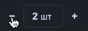

# vue-mzc-counter
Simple Vue2 counter component



[Online demo](https://codesandbox.io/s/competent-dhawan-exec2?file=/src/App.vue)

## Installation
```sh
npm install vue-mzc-counter --save
```

## Usage
```js
import VueMzcCounter from "vue-mzc-counter";

export default {
  components: {
    VueMzcCounter,
  },
  methods: {
    changeCounter(count) {
      console.log(count);
    }
  },
};
```
```html
<vue-mzc-counter :value="2" :max="12" unit="шт" @change="changeCounter" />
```
## Customize
```css
.vue-mzc-counter {
  --vue-mzc-counter-width: 120px;
  --vue-mzc-counter-height: 32px;
  --vue-mzc-counter-text-size: 14px;
  --vue-mzc-counter-unit-size: 12px;
  --vue-mzc-counter-text-color: #242424;
  --vue-mzc-counter-border-color: #cccccc;
  --vue-mzc-counter-disabled-color: #aaaaaa;
  --vue-mzc-counter-background-color: #ffffff;
  --vue-mzc-counter-primary-color: #306EC4;
  --vue-mzc-counter-glow-color: rgba(48, 110, 196, 0.15);
  --vue-mzc-counter-border-width: 1px;
  --vue-mzc-counter-border-radius: 4px;
}
```